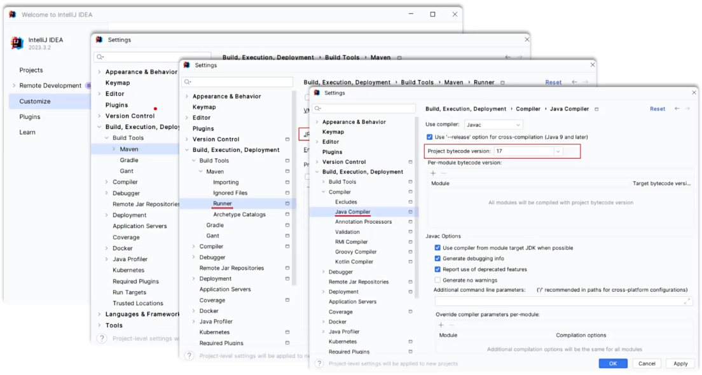

# Maven

## 安装

### 配置本地仓库

修改 conf/settings.xml 中的 \<localRepository> 为一个指定目录。

```xml
<localRepository>path\to\maven\mvn_repo</localRepository>
```

### 配置阿里云私服

修改 conf/settings.xml 中的 \<mirrors> 标签，为其添加如下子标签。

```xml
<mirror>
  <id>alimaven</id>
  <mirrorOf>central</mirrorOf>
  <name>aliyun maven</name>
  <url>http://maven.aliyun.com/nexus/content/groups/public/</url>
</mirror>
```

### 配置环境变量

MAVEN\_HOME 为 maven 的解压目录，并将其 bin 目录加入 PATH 环境变量。

### 测试

```powershell
mvn -v
```

## IDEA 集成 Maven

### 配置 Maven 环境（全局）

在欢迎界面进行全局配置。

<figure><figcaption></figcaption></figure>

### 创建 Maven 项目

创建模块，选择 New Module，填写模块信息，选择构建工具为Maven，点击create，创建完成。

### 导入 Maven 项目

todo

建议：将要导入的 maven 项目复制到自己的项目目录下；选择 maven 项目的 pom.xml 文件进行导入。

### 依赖管理

#### 依赖配置

坐标信息可以到 [https://mvnrepository.com/](https://mvnrepository.com/) 中搜索。

#### 生命周期

* clean
* compile
* test
* package
* install
